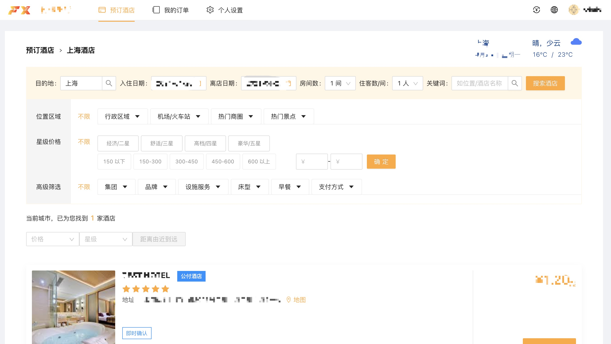
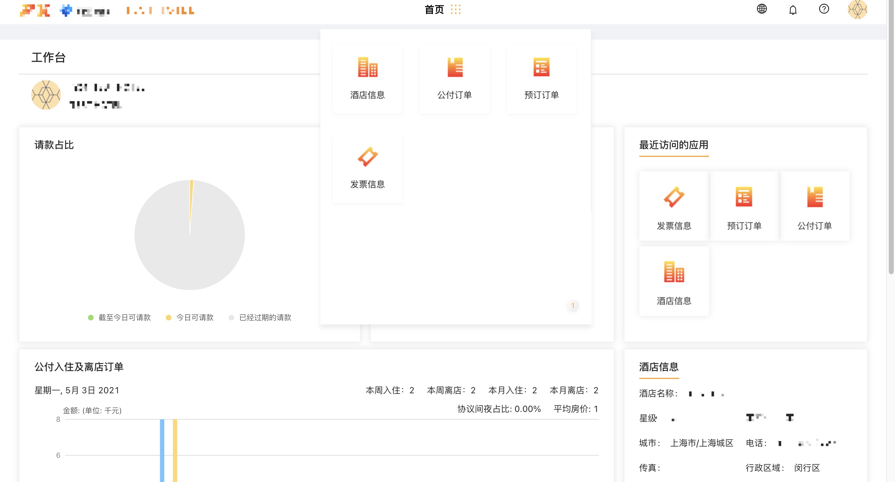

--------
#### 🌟个人信息

        24岁，性别女，现居于🏠上海市闵行区。
        2015年 - 2019年就读于河南工业大学，专业软件工程，主要课程C语言，C++，Java，计算机网络，数据结构等。
    由于对 java 兴趣缺缺，大三自学前端后入坑Node.js，毕业后一直从事于Node开发。
        英语水平： CET4

#### 🌟基础技能

* 熟悉 <u>ES6 promise/async/await/class</u> 等语法，有 <u>TypeScript</u> 使用经验， 熟练使用 <u>express，koa，egg，nest</u> 等常用框架开发项目。
* 能够使用 <u>mongo，mysql，redis</u>等数据库进行持久化，熟悉 <u>mongo</u> 第三方库 <u>mongoose</u> 的使用，能根据项目需求设计数据表及redis数据结构。
* 了解websocket，有完整项目开发经验。
* 有rabbitmq，es，nginx使用经验。
* 熟练使用docker打包项目和部署，了解k8s的使用。
* 对代码规范和质量有较高要求，能快速上手jest/mocha/chai等常见框架编写单元测试。
* 掌握Git版本工具，熟悉 <u>git flow</u> 工作流。
* 了解 <u>html/css/vue</u> 等前端技术。
* markdown语法爱好者，乐于使用md书写技术文档。

#### 🌟工作经验

* **2019年4月 至 2019年9月:  郑州爱云校公司**

    * **部分需求:**    使用 ffmpeg 截取视频中随机帧作为封面; 使用 mongo 聚合统计题库数据; 导出 excel 表格; 文件生成 pdf。

* **2019年10月 至今: 上海付迅信息科技有限公司**

    * 基于PMS/CRS系统的酒店管理，预定的差旅项目。

#### 🌟项目介绍

##### 1.主要功能

* **酒店搜索及预定：**



* **酒店端订单及房态管理：**



* **后台运营管理：** 
```酒店管理``` ```酒店房态管理``` ```客户管理``` ```订单管理``` ```售价管理``` ```结算管理```

##### 2.技术栈

* 数据持久化：mongodb
* 消息队列：rabbitmq
* 数据同步：elastic
* 框架：koa nest
* 前端：react


#### 🌟其他

- [ ] **自我描述：** 做事认真负责，能快速上手新项目，理解新需求，完成效率尚可，不崇尚无意义加班。乐于学习新事物，追求自我提高。
- [ ] **喜好：** 电影/动漫/看书/听歌/打游戏。